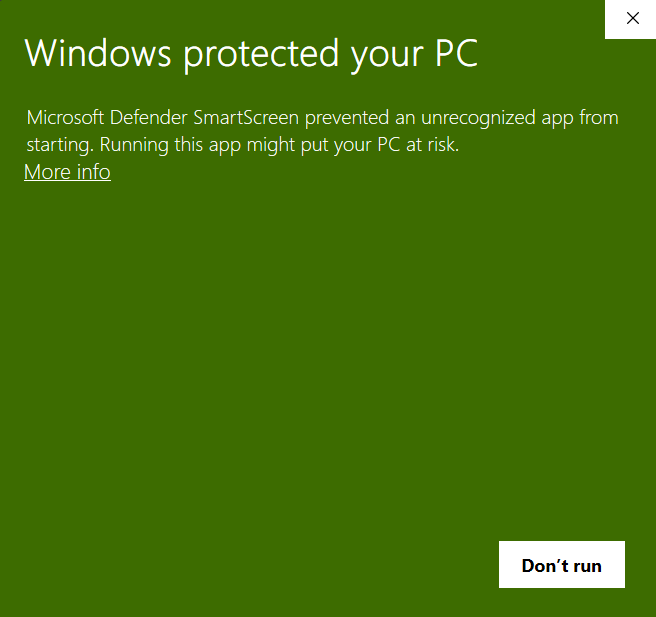
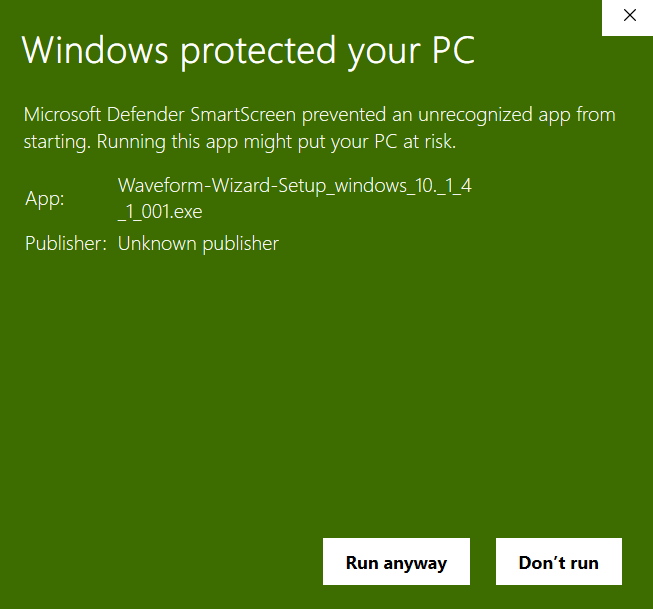
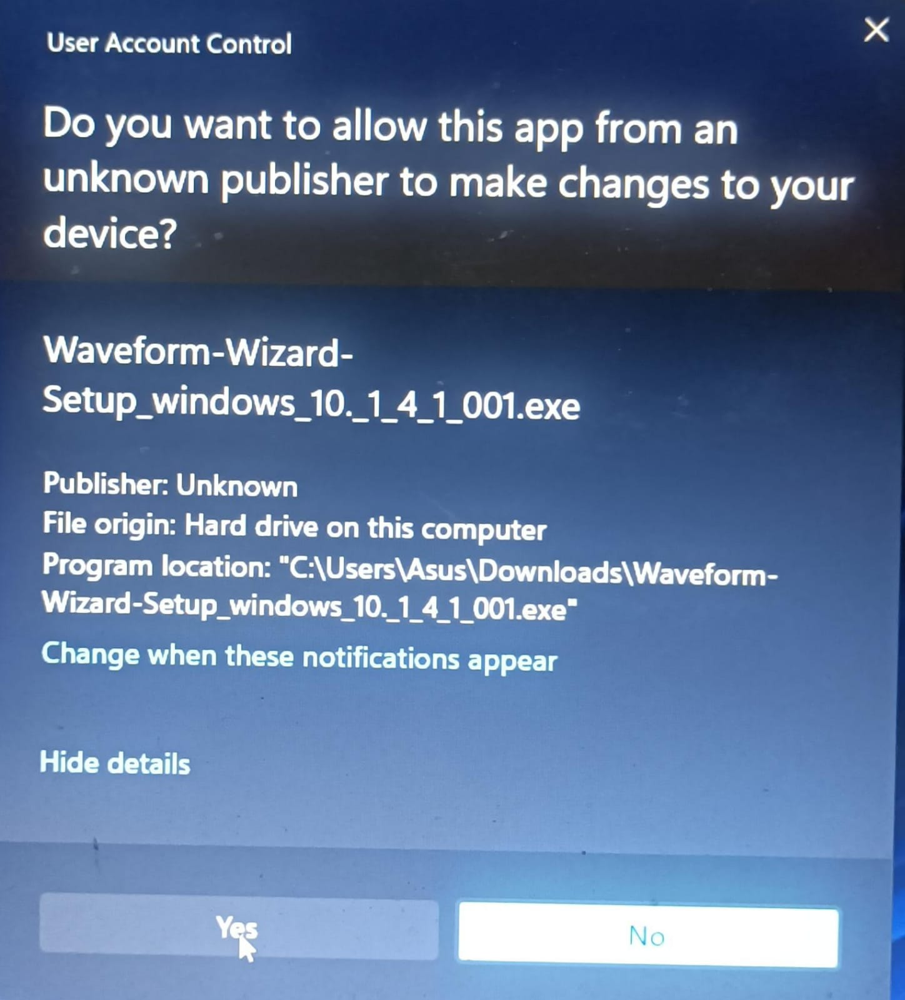
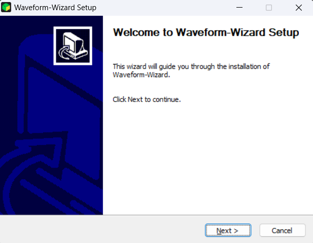
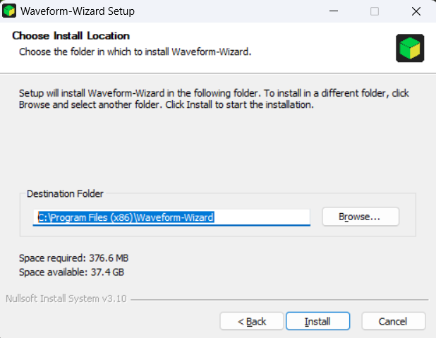
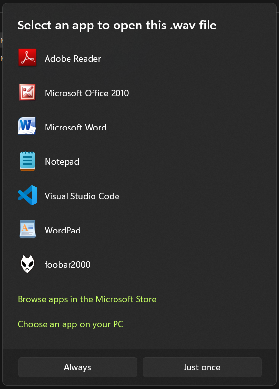
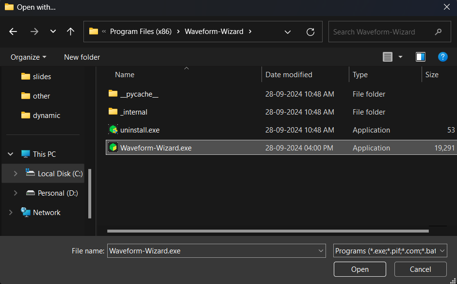
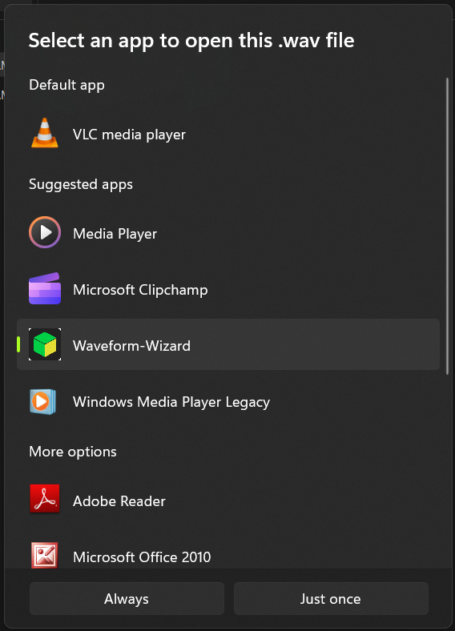

# Waveform-Wizard

Waveform-Wizard is a simple, fast and easy to use application to analyse sound signals

# Installation

## Ubuntu

Download the latest installation files from [Releases](https://github.com/Abhinavreddy-B/Waveform-Wizard-2/releases) Page.

* For ubuntu 20.04 -> Waveform-Wizard_ubuntu-20_04.deb
* For ubuntu 22.04 -> Waveform-Wizard_ubuntu-22_04.deb

Open the `.deb` with ubuntu's software installer.

(or)

In terminal, go to the directory containing the downloaded file and run:

```sh
$ sudo apt install ./Waveform-Wizard_ubuntu-<version>.deb
```

## Windows

1. Download the latest installation file from [Releases](https://github.com/Abhinavreddy-B/Waveform-Wizard-2/releases) Page.

    * For windows 10, 11 -> Waveform-Wizard-Setup_windows_10.exe

1. Run the `.exe` file.
1. Since we are not licensed developer with Microsoft, windows doesnt detect the application as safe as shown below:

    

1. Click on `More info`: 

    

1. Click on `Run anyway`
1. It will ask for permission to make changes to computer:

    

1. Click on `yes`.
1. An installer will open, click next:

    

1. It will prompt for a `Installation location`. change the location by clicking on `Browse..` and choose the desired location. it defaults to `C:\Program Files (x86)\Waveform-Wizard` as shown. then click `install`:

    

1. Wait for the installation to complete and click `next`.
1. click `Finish`

### (optional) (windows) File browser setup:

1. Right click on any `.wav` file, then click on `Open With` > `Choose another App`. A prompt apprears as follows:

    

1. Scroll down and Click on `Choose an app on your PC`
1. A file browser appears, now select `<installation path>/Waveform-Wizard.exe` and click `Open`. 

    > The default installation path is `C:\Program Files (x86)\Waveform-Wizard`. so the path to choose becomes `C:\Program Files (x86)\Waveform-Wizard\Waveform-Wizard.exe`

    

1. Now you will be back to application choosing screen, now you can see `Waveform-Wizard` in the list of applications, select it, and click on `Just Once` (or choose `Always` if you want to open all `.wav` using this application).

    

# Usage

## Windows

### From native file browser:
1. To use it this way, you need to do this one time setup: [instruction](#optional-windows-file-browser-setup)
1. after the one time setup, from the subsequent times open any `.wav` file directly by Right clicking, then `Open With` > `Waveform-Wizard`.

# TODO:

## AboutInfoWindow:

- [x] add version info from from github actions.
- [ ] IIITH and SPL logos add cheyyacchu
- [ ] inkemanna details add cheyyacchu
- [ ] move to components/views

## AudioComponent:

- [ ] Move file loading and file saving methods into this class instead of mainWindow, (file picker logic kuda indole cheseyyali)
- [ ] Refactor to accommodate multiple graphs, list of plots instead of single plot_other, ax_other, canvas_other.
- [x] removing radio buttons
- [ ] instead to add new plots, add an option in tool bar option: Pane -> New Pane -> plot name. 
- [x] While refactoring, better to have a base class. and all the plots will inherit some common functionality from base class. these  class objects of each plot can be put in components folder.
- [ ] save file an load file can should be changed to support multiplot
- [ ] Zoom in, Zoom out, move left, move right of the ax_waveform should change all the other plots to that x range and y range.
- [x] delete pane functionality

## MyMainWindow:

- [ ] rename the class to a better name
- [ ] Keep only 1 file per main window
- [ ] If a user tries to load another file, or wants to use 2 files at a time, just initialise another window(another application instance)
- [ ] accordingly remove the splitter (no longer required since we dont compare 2 files at a time)
- [ ] Remove orientation menu
- [ ] Add/ remove new options in File menu
- [ ] add Pane menu, with options to create new pane
- [x] delete pane context menu
- [ ] can add export menu either as a seperate menu or inside File menu

## Misc features:

Memory optimization:

- [ ] equate variables to None after using them, so that python can collect garbage
- [ ] use floats with less decimals to optimize for memory
- [ ] maybe look for matplotlib alternatives.

others:

- [x] Loading '.wav' files directly, like in windows on clicking any movies, we get 'open with vlc' , etc right. ala emanna. (not sure if this is feasible)
